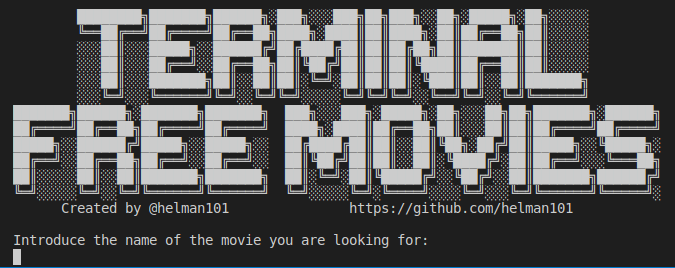

# Terminal free movies

> Web scraping can be done manually by a software user, the term typically refers to automated processes implemented using a bot or web crawler

this scraper helps you to find movies from your terminal, from the [123moviesfree](https://123moviesfree.net) page. 

## Built With

- Ruby
- nokogiri gem
- HTML & CSS knowledge

## Getting Started

To get a local copy up and running follow these simple example steps.
- Go to your terminal
- Clone the repo locally with `git clone https://github.com/helman101/movie-scraper`

### Prerequisites

- Ruby

### Try this scraper

After copy the repo you should follow this steps: 

- Go to the project folder `cd movie-scraper`
- Open your terminal

### Run tests

- run `ruby bin/main.rb` command

### Commands

- `/n`: Next movies page
- `/b`: Back to the last movies page
- `/s`: Stop the scraper
- Use a number to select the movie you want to see
## Author

👤 **Andres**

- GitHub: [@helman101](https://github.com/helman101)
- LinkedIn: [helman101](https://www.linkedin.com/in/helman101/)

## 🤝 Contributing

Contributions, issues, and feature requests are welcome!

Feel free to check the [issues page](https://github.com/helman101/movie-scraper/issues).

## Show your support

Give a ⭐️ if you like this project!

## 📝 License

This project is [MIT](https://github.com/helman101/movie-scraper/blob/README/LICENSE) licensed.

